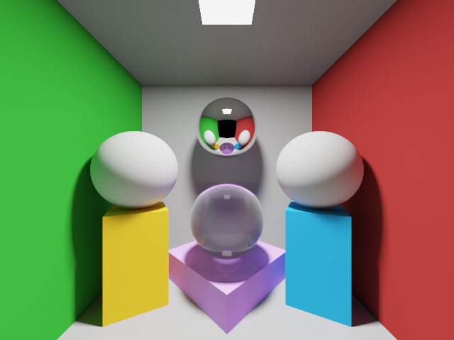

# A Monte Carlo Path Tracer in C++

Created by Denny Lindberg and Molly Middagsfjell for the course TNCG15: Advanced Global Illumination and Rendering.

# Features

- Implemented in C++17
- Path tracer using Monte Carlo probability theory
    - Russian Roulette for path termination
    - Lambertian, Oren-Nayar, Ideal Specular and Transparent/Refractive surface types
    - Progressive or Sequential rendering
    - Implicit and Explicit object types (spheres or triangle meshes)
- Realtime preview via OpenGL
    - Take screenshot at any time by pressing S
- Multi-threaded
- Time tracking for rendering
- Uses Reinhard or Exposure tone mapping

# Libraries used

**glad** for OpenGL bindings - https://github.com/Dav1dde/glad

**SDL2** for creating a cross-platform OpenGL window with input - https://www.libsdl.org

**glm** for vector and matrix data types compatible with OpenGL - https://glm.g-truc.net/0.9.9/index.html

**lodepng** for loading and saving PNG files - https://lodev.org/lodepng/

# Getting started

Get **premake5** for generating makefiles or solutions for your IDE - https://premake.github.io/download.html

After downloading the executable, place it in the root folder. Run `premake5 vs2017` (Windows) or `premake5 xcode4` (MacOS) in the terminal or command line to generate a Visual Studio 2017 solution (the solution ends up in the temp folder). Open the solution and you're good to go.

## Folder structure

**binaries/** - contains compiled executable, dlls, images, configs or audio. (screenshots end up here)

**include/** - thirdparty includes.

**libs/** - windows specific libs.

**source/** - main folder for source code.

**temp/** - this folder is generated by premake5 and contains the solution. This folder can be deleted at any time.

## Install libs for SDL2 if you are not on Windows

Follow this guide for MacOSX: http://lazyfoo.net/tutorials/SDL/01_hello_SDL/mac/index.php